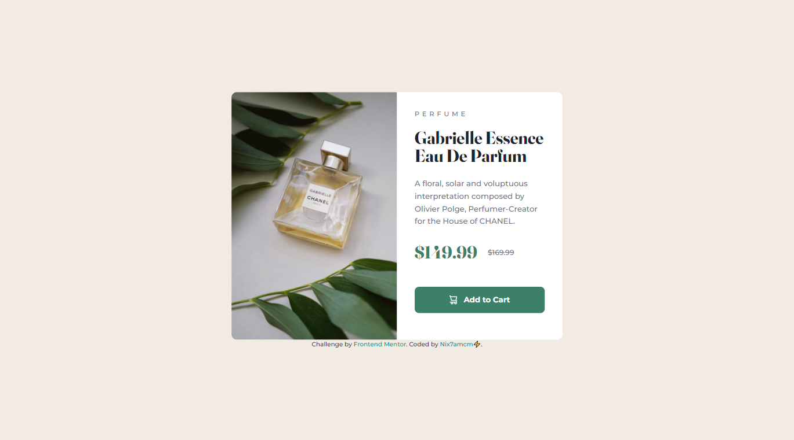
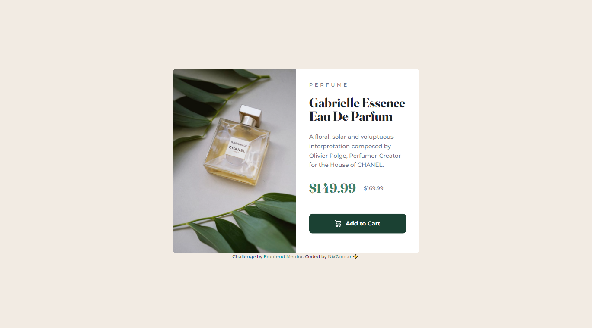
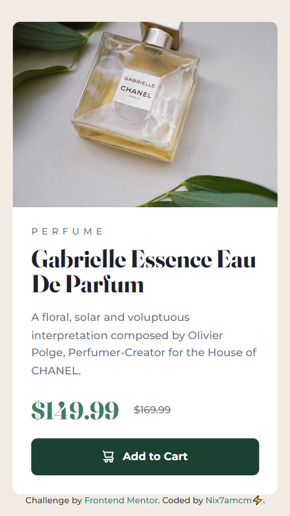

# Frontend Mentor - Product preview card component solution

This is my solution to the [Product preview card component challenge on Frontend Mentor](https://www.frontendmentor.io/challenges/product-preview-card-component-GO7UmttRfa).

## Table of contents

- [Overview](#overview)
  - [Challenge Requirements](#challenge-requirements)
- [Screenshots](#screenshots)
- [Links](#links)
- [My process](#my-process)
  - [Built with](#built-with)
  - [Useful resources](#useful-resources)
- [Author](#author)

---

## Overview

👩🏻‍💻 [Frontend Mentor](www.frontendmentor.io) challenges help you improve your coding skills by building realistic projects.

⚡ This challenge was to build a responsive product preview card component.

🚀 I built this using HTML and CSS, with the help of [Figma](https://www.figma.com) for studying the design.

### Challenge Requirements

Users should be able to:

- View the optimal layout depending on their device's screen size
- See hover and focus states for interactive elements

---

## Screenshots

---

## Links

- Solution URL: [frontendmentor.io/solutions/product-preview-card-component-9PWzkZv_hy](https://www.frontendmentor.io/solutions/product-preview-card-component-9PWzkZv_hy)
- Live Site URL: [nix7amcm.github.io/FEM-product-preview-card-component/](https://nix7amcm.github.io/FEM-product-preview-card-component/)

---

## My process

### Built with

- Semantic HTML5 markup
- CSS custom properties
- Flexbox
- CSS Grid
- Figma

### Useful resources

- [Tailwind.css](https://tailwindcss.com/) - This helped me add [fallback fonts](https://tailwindcss.com/docs/font-family) to cover all browsers, and the [sr-only](https://tailwindcss.com/docs/screen-readers#screen-reader-only-elements) class style for the hidden header with the h1 title, so that it could still be accessed by screen readers.
- [box-shadow.dev](https://box-shadow.dev/) - This is a great box-shadow generator! I've used a few of these to date and this is definitely one of the more straightforward options. You can style the element on the right similar to what you want to apply the shadow to in your project, tinker with the shadows, then simply copy the code for the box-shadow.

---

## Author

- Website - [Nix7amcm](https://github.com/Nix7amcm)
- Frontend Mentor - [@Nix7amcm](https://www.frontendmentor.io/profile/Nix7amcm)
- LinkedIn - [amcm-8807](https://www.linkedin.com/in/amcm-8807/)

---
---